# Scmlb

scmlb は XDP を利用したシンプルな L4 ロードバランサーです．

> **Warning**
> このプロジェクトは main ブランチ上には XDP のデータプレーン実装が空です。
> [complete-xdp-parts ブランチ](https://github.com/terassyi/seccamp-xdp/tree/complete-xdp-parts)に完成版があります。
>
> XDP の実装を見たい方、動作確認をしたい方は [complete-xdp-parts ブランチ](https://github.com/terassyi/seccamp-xdp/tree/complete-xdp-parts)を参照してください。
>
> また、このプログラムは Linux 上でのみ動作します。(Docker on Mac や Docker on Windows, WSL 上では動作しません。)


## 概要

scmlb は ロードバランサー本体のデーモンプログラムの `scmlbd` と それを操作するための CLI プログラムの `scmlb` の二つのプログラムから構成されます．

以下の図は scmlb の概要図です．
`scmlbd` がホスト上で動作し，upstream, backend の 各 NIC に XDP プログラムがロードされています．
upstream から受信した VIP 当てのパケットを backend として登録されたホストに転送します．
`scmlb` コマンドを介して backend の登録や解除，状態の参照を行います．


## ビルド

ビルドには Go 言語の 1.20 以上が必要です．
もしビルドするマシンの Go 言語が 1.20 未満の場合は以下を実行して Go 言語を再インストールしてください．

```
$ sudo rm -rf /usr/local/go
$ make -C ../ setup-golang
$ go version
```

次に，eBPF を利用するためのセットアップと gRPC を利用するためのセットアップを行います．

```
# eBPF のセットアップ
$ make -C ../ setup
# gRPC のセットアップ
$ make setup
```

最後にプロジェクトをビルドします．

```
$ make build
```

ビルドが完了すると `bin/` に実行ファイルが生成されます．

## 設計

### コントロールプレーン

TBD

### データプレーン

データプレーンはXDPで実装しています。
XDP関連のコードは `bpf/` に配置しています。
`bpf/include/` 以下にロードバランサーの実装に必要な BPF マップや構造体の定義しています。
実際の処理は `bpf/xdp.c` に記述しています。

XDP により実装するロードバランサーの各機能は機能ごとに関数に分割しており、 tail call を用いて連結しています。


tail call による処理の流れは以下のようになっています。


#### パケットカウンタ

`count()` 関数にパケットカウンタの処理を実装しています。
値を保存する BPF マップとして `bpf/include/maps.h` の `counter` マップを利用します。
該当するプロトコルのパケットを受信したらプロトコル番号をキーとして、これまでに受信したパケット数を取得して値をインクリメントします。

#### ファイアウォール

`firewall()` 関数にファイアウォールの処理を実装しています。

scmlb のファイアウォールはデフォルトですべてのパケットを許可します。
明示的にルールを追加することで対象のパケットを拒否します。

以下にファイアウォールの処理の流れを示します。



ルールのマッチに利用する BPF マップは以下の2つです。それぞれ `bpf/include/maps.h` に定義されています。
1. adv_rulematcher
2. adv_rules

`adv_rulematcher` は LPM Trie の BPF マップです。
IPv4 アドレスとそのプレフィックス長を u64 にシリアライズした値をキー、バリューには `FIRE_WALL_RULE_MAX_SIZE_PER_NETWORK` に指定された長さの u16 の配列を定義しています。
配列の要素にはそのネットワークに対して登録されているルールの id を格納します。
`adv_rules` は ハッシュの BPF マップです。
キーはファイアウォールのルール id です。
バリューは ファイアウォールのルールの実体である `fw_rule` 構造体(`bpf/include/scmlb.h` に定義しています。) を定義しています。

受信したパケットが登録されているルールにマッチしているかどうかは二段階で判断します。

第一段階として、受信したパケットの送信元アドレスから `adv_rulematcher` を探索してマッチしたネットワークが存在したら、`adv_rulematcher` のバリューである u16 の配列を取得します。
第2段階として、取得した u16 の配列を走査して ルール id が格納されていた場合、その id をもとに `adv_rules` を探索して `fw_rule` を取得します。
取得した `fw_rule` と受信したパケットを比較してルールにマッチしたらパケットをドロップします。
ルールにマッチしなかった場合は次の id を取得します。

#### ロードバランサー

ロードバランサー機能はクライアントからパケットを受信したときに処理する `lb_ingress()` 関数とバックエンドのアプリケーションサーバーからパケットを受信したときに処理する `lb_egress()` 関数の二つの関数に実装しています．

下図は `lb_ingress()` と `lb_egress()` の大まかな処理の概要図です．


##### lb_ingress

`lb_ingress()` 関数は upstream(クライアント側)から受信したパケットを処理します．
以下に `lb_ingress()` 関数の処理の流れを示します．


`lb_ingress()` 関数は tail call で呼び出されます．
最初に Ethernet, IPv4 ヘッダを解析します．
その後 L4 プロトコルを判別して TCP と UDP で処理を分岐します．
それぞれのプロトコルでバックエンドの選択やコネクションの状態管理，転送準備などの処理を行った後，転送先のバックエンドにリダイレクトします．

##### lb_egress

`lb_egress()` 関数はバックエンド(アプリケーションサーバー)から受信したパケットを処理します．
以下に `lb_egress()` 関数の処理の流れを示します．


`lb_egress()` 関数も同様に tail call で呼び出されます．
最初に Ethernet, IPv4 ヘッダを解析します．
その後 L4 プロトコルを判別して TCP と UDP で処理を分岐します．
`lb_ingress()` 関数と同様にそれぞれのプロトコルでコネクションの状態管理や転送準備を行った後，upstreamにリダイレクトします．


##### handle_tcp_ingress

`handle_tcp_ingress()` 関数は `lb_ingress()` 関数の中で呼び出されて，TCP コネクションを処理する関数です．
引数として以下の値を受け取ります．

- TCP ヘッダ(`struct tcphdr`)
- IPv4 ヘッダ(`struct iphdr`)
- 送信元の MAC アドレス(長さ 6 の u8 の配列)
- 転送先のバックエンドを格納するための backend 構造体

`handle_tcp_ingress()` 関数の処理の流れを下図に示します．


`handle_tcp_ingress()` 関数の処理は既存のコネクションに属するパケットを扱うか，新規のコネクションを扱うかによって処理が分岐します．

まずは引数として受け取った各種ヘッダからコネクションを一意に識別するための `5-tuple` である `connection` 構造体を作成します．
次に，作成した `connection` 構造体を用いて `conntrack` マップを引いて，そのコネクションが既存のものかどうかを判別します．
conntrack マップから取得する値の型は `connection_info` 構造体です．

値が取れた場合，既存のコネクションに属するパケットとして処理を続行します．
まずは TCP ヘッダにセットされている TCP フラグをもとにコネクションの状態を遷移させます．
次に，取得した `connection_info` 構造体の `id` フィールドに格納されている転送先バックエンド id をキーとしてロードバランサーに登録されているバックエンドの情報を保存している `backend_info` マップを引いて転送先バックエンドの情報を取得します．
バックエンドの情報が取得出来たら， IP ヘッダの宛先アドレスをそのバックエンドの IP アドレスに書き換えます．
それに伴って TCP, IPv4 ヘッダそれぞれのチェックサムを再計算します．
最後に取得したバックエンド情報である `backend` 構造体を 引数の `target` にコピーします．

値が取れなかった場合，新規コネクションのパケットとして処理を行います．
まずは新規コネクションを割り当てるバックエンドを選択します．
選択したバックエンドの id は `selected_backend_id` グローバル変数に保存されるのでそれをもとに `backend_info` マップを引いてバックエンドの情報を取得します．
次に，`conntrack` マップに保存する `connection_info` 構造体を初期化します．
このとき，`connection_info` の `status` フィールドは `Opening` 状態を代入します．
そして，`connection` 構造体と `connection_info` 構造体をキーバリューとして `conntrack` マップに保存します．
最後に IP ヘッダの宛先アドレスを選択したバックエンドの IP アドレスに書き換えます．
それに伴って TCP, IPv4 ヘッダそれぞれのチェックサムを再計算します．
最後に取得したバックエンド情報である `backend` 構造体を 引数の `target` にコピーします．

##### handle_tcp_egress

`handle_tcp_egress()` 関数は `lb_egress()` 関数から呼び出されて，TCP パケットを処理する関数です．
引数として以下を受け取ります．

- TCP ヘッダ(`struct tcphdr`)
- IPv4 ヘッダ(`struct iphdr`)
- upstream 情報(`upstream` 構造体)
- コネクションの情報を格納するための `connection_info` 構造体

`handle_tcp_egress()` 関数の処理の流れを下図に示します．


最初に引数で与えられた TCP, IPv4 ヘッダと upstream 構造体の情報から `connection` 構造体を作成します．
作成した `connection` 構造体をキーに `conntrack` マップを引いて `connection_info` 構造体を取得します．
ここで，値が取れなかった場合は `conntrack` に情報が登録されていないためロードバランサー宛てのパケットではないとみなします．
値が取れた場合，そのコネクションの状態を更新します．
次に，IP ヘッダの送信元アドレスを upstream のアドレス(ロードバランサーの VIP)に書き換えます．
それに伴って TCP, IPv4 ヘッダそれぞれのチェックサムを再計算します．
最後に，取得した `connection_info` 構造体を引数の `target` にコピーします．

## 使い方

`scmlb` でロードバランサーを操作するためにはまず `scmlbd` を起動しておく必要があります。

### scmlbd

実行ファイルのパスは適宜置き換えてください。
また、実行には root 権限が必要です。
`start` サブコマンドでロードバランサーを起動します。

```console
$ bin/scmlbd start -h
start scmlb daemon

Usage:
  scmlbd start [flags]

Flags:
  -a, --api-addr string    API server serving address (default "127.0.0.1")
  -p, --api-port int32     API server serving port (default 5000)
  -g, --gc                 enable conntrack GC
  -t, --gc-time duration   lifetime of conntrack entries (default 1h0m0s)
  -h, --help               help for start
  -u, --upstream string    upstream interface (default "eth0")
  -v, --vip string         Virtual IP address to expose as the service address

Global Flags:
      --json            Json format log
      --level int       Log level
      --output string   Log output target (default "stdout")
```

```console
$ sudo bin/scmlbd start --upstream h0 --vip 203.0.113.11 --gc
```


### scmlb

scmlb コマンドは以下のサブコマンドにより構成されています。

```console
$ bin/scmlb -h
scmlb(security mini camp load balancer) is the toy locad balancer.
 scmlb command is cli to control scmlbd

Usage:
  scmlb [flags]
  scmlb [command]

Available Commands:
  completion     Generate the autocompletion script for the specified shell
  dos-protection DoS protection policy subcommands
  fw             manage a fire wall function
  help           Help about any command
  lb             lb related command
  stat           show statistics information

Flags:
      --endpoint string   endpoint for API server (default "127.0.0.1")
  -h, --help              help for scmlb
      --json              Json format log
      --level int         Log level
      --output string     Log output target (default "stdout")
      --port int          endpoint's port for API server (default 5000)
  -v, --version           version for scmlb

Use "scmlb [command] --help" for more information about a command.
```

#### fw

firewall に関するサブコマンドです。

##### set

firewall のルールをセットします。
指定可能なフラグは以下です。

```console
$ scmlb fw set -h
set a fire wall rule

Usage:
  scmlb fw set [flags]

Flags:
  -d, --dst-port string   port range to deny(example: 22, 5000-6000) (default "0")
  -h, --help              help for set
  -n, --network string    network range to deny by fire wall (default "0.0.0.0/0")
  -t, --protocol string   transport protocols to deny(expected value is any/icmp/tcp/udp) (default "any")
  -s, --src-port string   port range to deny(example: 22, 5000-6000) (default "0")
```

###### 例

以下の例ではすべての送信元からの 8000 から 9000 番ポート宛の TCP のパケットをドロップするルールを追加しています。

```console
$ scmlb fw set -n 0.0.0.0/0 -d 8000-9000 -t tcp
```

##### get

セットされている firewall のルールを参照しています。

###### 例

```console
$ scmlb fw get

ID       NETWORK        SRCFROMPORT     SRCTOPORT       DSTFROMPORT     DSTTOPORT       PROTOCOL        DROPPED
1       0.0.0.0/0            0              0              8000           9000            tcp              0
```

##### delete

セットされている firewall ルールを削除します。

```console
$ scmlb fw delete -h
delete a fire wall rule

Usage:
  scmlb fw delete [flags]

Flags:
  -h, --help       help for delete
  -i, --id int32   rule id to delete (default -1)
```

###### 例

以下の例では id 1 でセットされているルールを削除しています。

```console
$ scmlb fw delete -i 1
```

#### dos-protection

簡易的な DoS protection 機能に関するサブコマンドです。
scmlb の DoS protection 機能は非常に単純な機能のみを提供します。

一つの送信元アドレスから任意のプロトコル(TCP, UDP, ICMP) の任意の特徴(TCP のフラグのみ指定可能)にマッチしたパケットが秒間に制限数以上届いた場合その送信元からのそのプロトコルのパケットをドロップする firewall ルールを追加します。

##### set

DoS protection のポリシーを追加します。

```console
scmlb dos-protection set -h
set DoS protection policies

Usage:
  scmlb dos-protection set [flags]

Flags:
  -h, --help              help for set
  -l, --limit int         limit of the number of packets to accept to receive (default 256)
  -p, --protocol string   target protocol
  -t, --type string       target packet type
```

###### 例

以下の例では TCP SYN パケットが秒間 1000 パケット届いたときに発動して firewall ルールが追加されるポリシーをセットしています。

```console
$ scmlb dos-protection set -p tcp -t syn -l 1000
```

##### get

適用されている DoS protection ポリシーを参照します。

###### 例

```console
$ scmlb dos-protection get

ID      PROTOCOL        TYPE    LIMIT      STATUS
1         tcp           syn     1000    not triggered
```

##### delete

セットされている DoS protection ポリシーを削除します。

```console
$ scmlb dos-protection delete -h
delete a DoS protection policy

Usage:
  scmlb dos-protection delete [flags]

Flags:
  -h, --help       help for delete
  -i, --id int32   DoS protection policy id to delete
```

###### 例

以下の例は id 1 の DoS protection ポリシーを削除しています。

```console
$ scmlb dos-protection delete -i 1
```

#### lb

ロードバランサー関連のサブコマンドです。

##### set

ロードバランサーのバックエンドを追加します。
バックエンドのアドレスとそのバックエンドとの疎通確認のためのエンドポイント(この部分は未実装です)を指定することでバックエンドとして追加します。
追加するバックエンドはロードバランサーが動いているホストから疎通できる必要があります。

```console
$ scmlb lb set -h
set lb backend

Usage:
  scmlb lb set [flags]

Flags:
  -a, --address string       IP address of a lb backend
  -c, --healthcheck string   healthchecing path (default "/")
  -h, --help                 help for set
  -n, --name string          name of a lb backend
```

###### 例

`10.0.5.2` のアドレスのバックエンドを `node5` という名前で登録しています。

```console
$ scmlb lb set -n node5 -a 10.0.5.2 -c http://10.0.5.2:8080/health
```

##### get

登録されているバックエンドを参照します。

###### 例

```console
$ scmlb lb get

ID      NAME    IP ADDR             MAC ADDR            DEVICE          HEALTHCHECK              STATUS
1       node5   10.0.5.2        1a:22:35:d3:66:52       h2-h6   http://10.0.5.2:8080/health     Available
```

##### drain

セットされているバックエンドに新規のコネクションを割り当てないようにします。
この状態では既存のコネクションは通常通り処理することができます。

```console
$ scmlb lb drain -h
drain existing connection. mark unavailable to target backend.

Usage:
  scmlb lb drain [flags]

Flags:
  -h, --help       help for drain
  -i, --id int32   backend id to delete
```

###### 例

以下の例では id 1 のバックエンドを drain しています。

```console
$ scmlb lb drain -i 1
```

##### delete

登録されているバックエンドを削除します。
このコマンドはすでに drain されているバックエンドにのみ有効です。

```console
$ scmlb lb delete -h
delete a lb backend

Usage:
  scmlb lb delete [flags]

Flags:
  -h, --help       help for delete
  -i, --id int32   backend id to delete
```

###### 例

以下の例では id 1 のバックエンドを削除しています。

```console
$ scmlb lb delete -i 1
```

##### conntrack get

ロードバランサーが現在処理しているコネクション一覧を参照します。

###### 例

```console
$ scmlb lb conntrack get

src addr          dst addr      src port        dst port        protocol        backend id        status             timestamp
10.0.1.1        203.0.113.11     32808            7070            tcp               1           established     2023-08-08t13:15:23z
```

## クイックスタート

ここでは簡単に動作環境を行います。

> **Note**
> complete-xdp-parts ブランチでビルドしなければ XDP プログラムは動作しません。
>
> main ブランチでもビルド自体は通りますが XDP のパケット処理部が未実装のため動作しません。

以下のコマンドで動作確認のためのトポロジー netns を利用して作成、scmlb/scmlbd のビルド、 scmlbd の起動を行っています。
テスト用のトポロジーは以下のようになっています。





```console
$ make devenv
make -C ../ clean-topology
make[1]: Entering directory '/home/terassyi/workspace/seccamp-xdp'
sudo ip netns del host0 2>/dev/null || true
sudo ip netns del host1 2>/dev/null || true
sudo ip netns del host2 2>/dev/null || true
sudo ip netns del host3 2>/dev/null || true
sudo ip netns del host4 2>/dev/null || true
sudo ip netns del host5 2>/dev/null || true
sudo ip netns del host6 2>/dev/null || true
sudo ip netns del host7 2>/dev/null || true
sudo ip link del dev vipdev 2>/dev/null || true
make[1]: Leaving directory '/home/terassyi/workspace/seccamp-xdp'
make clean || true
make[1]: Entering directory '/home/terassyi/workspace/seccamp-xdp/scmlb'
rm bin/scmlb
rm bin/scmlbd
rm pkg/rpc/scmlb.pb.go
rm pkg/rpc/scmlb_grpc.pb.go
find pkg/ -type f -name '*bpfe*' -delete
make[1]: Leaving directory '/home/terassyi/workspace/seccamp-xdp/scmlb'
make build
make[1]: Entering directory '/home/terassyi/workspace/seccamp-xdp/scmlb'
go generate ./...
Compiled /home/terassyi/workspace/seccamp-xdp/scmlb/pkg/loader/xdpprog_bpfel.o
Stripped /home/terassyi/workspace/seccamp-xdp/scmlb/pkg/loader/xdpprog_bpfel.o
Wrote /home/terassyi/workspace/seccamp-xdp/scmlb/pkg/loader/xdpprog_bpfel.go
Compiled /home/terassyi/workspace/seccamp-xdp/scmlb/pkg/loader/xdpprog_bpfeb.o
Stripped /home/terassyi/workspace/seccamp-xdp/scmlb/pkg/loader/xdpprog_bpfeb.o
Wrote /home/terassyi/workspace/seccamp-xdp/scmlb/pkg/loader/xdpprog_bpfeb.go
mkdir -p pkg/rpc
PATH=/home/terassyi/workspace/seccamp-xdp/scmlb/bin:'/home/terassyi/.deno/bin:/usr/local/sbin:/home/terassyi/.local/bin:/home/terassyi/.cargo/bin:/home/terassyi/.local/share/aquaproj-aqua/bin:/usr/local/go/bin:/home/terassyi/go/bin:/home/terassyi/.zplug/bin:/usr/local/sbin:/usr/local/bin:/usr/sbin:/usr/bin:/sbin:/bin:/usr/games:/usr/local/games:/snap/bin:/home/terassyi/.cache/dein/repos/github.com/junegunn/fzf/bin' /home/terassyi/workspace/seccamp-xdp/scmlb/bin/protoc -I=/home/terassyi/workspace/seccamp-xdp/scmlb/protobuf/include:. --go_out=module=github.com/terassyi/seccamp-xdp/scmlb:pkg protobuf/scmlb.proto
mkdir -p pkg/rpc
PATH=/home/terassyi/workspace/seccamp-xdp/scmlb/bin:'/home/terassyi/.deno/bin:/usr/local/sbin:/home/terassyi/.local/bin:/home/terassyi/.cargo/bin:/home/terassyi/.local/share/aquaproj-aqua/bin:/usr/local/go/bin:/home/terassyi/go/bin:/home/terassyi/.zplug/bin:/usr/local/sbin:/usr/local/bin:/usr/sbin:/usr/bin:/sbin:/bin:/usr/games:/usr/local/games:/snap/bin:/home/terassyi/.cache/dein/repos/github.com/junegunn/fzf/bin' /home/terassyi/workspace/seccamp-xdp/scmlb/bin/protoc -I=/home/terassyi/workspace/seccamp-xdp/scmlb/protobuf/include:. --go-grpc_out=module=github.com/terassyi/seccamp-xdp/scmlb:pkg protobuf/scmlb.proto
mkdir -p bin
go build -o bin/scmlb cmd/scmlb/main.go
mkdir -p bin
go build -o bin/scmlbd cmd/scmlbd/main.go
make[1]: Leaving directory '/home/terassyi/workspace/seccamp-xdp/scmlb'

... 以下略
```

scmlbd が起動したら別のターミナルからテスト用アプリケーションを複数の netns で起動します。

```console
$ make run-test-app
make -C ../ build-test-app
make[1]: Entering directory '/home/terassyi/workspace/seccamp-xdp'
make[1]: Nothing to be done for 'build-test-app'.
make[1]: Leaving directory '/home/terassyi/workspace/seccamp-xdp'
mkdir -p ./run
sudo ./run-test-app.sh
+ echo 999225
+ ip netns exec host5 ../app/app
+ echo 999226
+ echo 999227
+ ip netns exec host6 ../app/app
+ ip netns exec host7 ../app/app
```

このテスト用アプリケーションは以下のポートでサーバーが動作しています。

| Server | Port |
| --- | --- |
| HTTP | 8080 |
| TCP Echo | 7070 |
| UDP | 9090 |

ここで以下のように動作確認することができます。

```console
$ make connectivity-test
sudo ip netns exec host2 bin/scmlb lb set -n node5 -a 10.0.5.2 -c http://10.0.5.2:8080/health # host6 ns
sudo ip netns exec host2 bin/scmlb lb set -n node4 -a 10.0.4.2 -c http://10.0.4.2:8080/health # host5 ns
sleep 3
sudo ip netns exec host1 curl -m 2 http://203.0.113.11:8080/who
10.0.4.2sudo ip netns exec host1 curl -m 2 http://203.0.113.11:8080/who
10.0.5.2sudo ip netns exec host1 curl -m 2 http://203.0.113.11:8080/who
10.0.4.2sudo ip netns exec host1 curl -m 2 http://203.0.113.11:8080/who
10.0.5.2%
$ make drain-test
sudo ip netns exec host1 curl -m 2 http://203.0.113.11:8080/who
10.0.4.2sudo ip netns exec host1 curl -m 2 http://203.0.113.11:8080/who
10.0.4.2sudo ip netns exec host1 curl -m 2 http://203.0.113.11:8080/who
10.0.4.2sudo ip netns exec host1 curl -m 2 http://203.0.113.11:8080/who
10.0.4.2sudo ip netns exec host2 bin/scmlb lb get

ID      NAME    IP ADDR             MAC ADDR            DEVICE          HEALTHCHECK               STATUS
1       node5   10.0.5.2        6e:6e:28:25:f9:ca       h2-h6   http://10.0.5.2:8080/health     Unavailable
2       node4   10.0.4.2        82:66:82:c1:b6:69       h2-h5   http://10.0.4.2:8080/health      Available

sudo ip netns exec host2 bin/scmlb lb delete --id 1
sudo ip netns exec host2 bin/scmlb lb get

ID      NAME    IP ADDR             MAC ADDR            DEVICE          HEALTHCHECK              STATUS
2       node4   10.0.4.2        82:66:82:c1:b6:69       h2-h5   http://10.0.4.2:8080/health     Available
```

動作確認終了後はテストアプリケーションを終了します。

```console
$ make stop-test-app
sudo kill -9 `cat ./run/app1.pid`
sudo kill -9 `cat ./run/app2.pid`
sudo kill -9 `cat ./run/app3.pid`
rm -rf ./run
```
